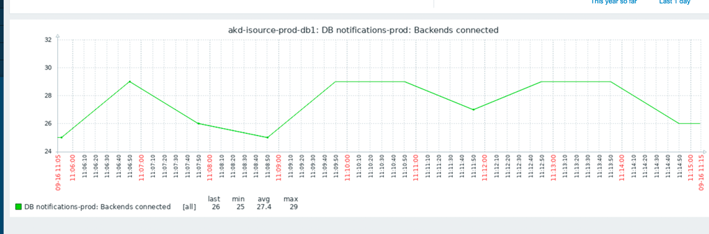
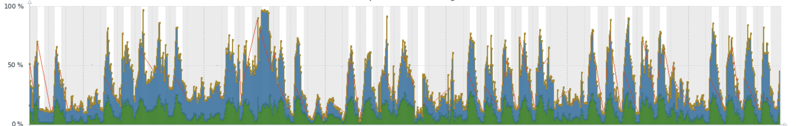
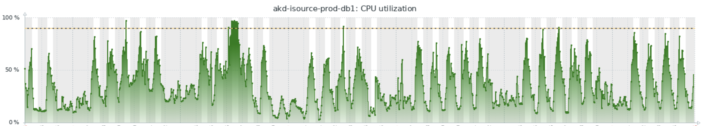

# Сбор и использование статистики 

Пред-история - есть небольшой проект на поддержке - из разряда написали и забыли.
В какой-то момент начали возникать проблемы:
аликешен выбирал все разрешенные ему соединеия, проседание 
производительности сервера базы даннных (на сервере несколько баз разлиных проектов)





В процессе анализа было выявленно отсутвие каких либо либо индексов 
на таблицах. Необходимость изменения параметров автовакума.

Был выполнен vacuum full одной из таблиц (в тот момент ее размер достиг 80Gi)
Установлено pgcompacttable и pgstattuple.

В связи с отсутствием разработки в проекте - изменеие апи, струкруры данных или логики - невозможно.
Делаем что можем называется.


Основной проблемный запрос на тот момент:

```sql
SELECT id, distribution_id, created_at, title, from_who, body, send_to, receiver, channel, status, original_body, report FROM notifications WHERE channel IN (1)  AND (status IN (3) ) AND title LIKE $1 AND receiver = $2 ORDER BY created_at DESC LIMIT 5 OFFSET 0
SELECT id, distribution_id, created_at, title, from_who, body, send_to, receiver, channel, status, original_body, report FROM notifications WHERE channel IN (1)  AND (status IN (3) ) AND title LIKE $1 AND receiver = $2 ORDER BY created_at DESC LIMIT 5 OFFSET 0
```

```sql

create table notifications (
    id bigserial primary key,
    distribution_id bigint references distributions(id),
    created_at timestamp default now() not null,
    title text not null,
    from_who text not null,
    body text not null,
    send_to text not null,
    channel numeric not null,
    receiver text references users(uid),
    status bigint not null references status_types(id),
    original_body json default '{}'::json not null,
    report text
);
```
После анализа вариантов, были добавлены 3 индекса:

```sql
CREATE INDEX IF NOT EXISTS notifications_title_gin_idx ON notifications using GIN(title gin_trgm_ops);
CREATE INDEX IF NOT EXISTS notifications_create_at_idx ON notifications (created_at DESC);
CREATE INDEX IF NOT EXISTS notifications_receiver_idx ON notifications USING btree (receiver) WHERE (channel = (1)::numeric);
```
Дополнительно пришлось править в код - чтобы убрать варианты запросов с LIKE = '%%'

И следующий проблемный запрос

```sql
SELECT id, distribution_id, created_at, title, from_who, body, send_to, receiver, channel, status, original_body, report FROM notifications WHERE channel IN (1)  AND (status IN (3) ) AND receiver = 'uuid' ORDER BY created_at DESC LIMIT 5 OFFSET 0;
```
```sql
CREATE INDEX IF NOT EXISTS notifications_csr_ndx on notifications(channel,status,receiver) ;
CREATE INDEX IF NOT EXISTSnotifications_csrd_ndx on notifications (receiver, channel, status, created_at DESC);
```
explain - не сохранился к сожалению

PS Как бы не хотелось выполнить оба варианта - наличие свободного времени диктует свои правила
